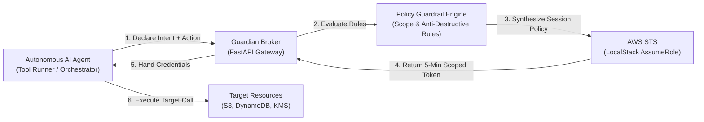

# Agentic IAM Guardian

A dynamic Just-In-Time (JIT) identity broker and zero-trust policy engine built for autonomous AI agents operating in cloud environments.

---

## Why I Built This

I got interested in a specific problem: what happens when we give autonomous AI agents actual credentials to touch cloud infrastructure?

If you give an AI assistant an IAM role to deploy a service or run queries, you face an uncomfortable tradeoff. If the role has broad permissions, a single prompt injection or agent hallucination can delete production tables or spin up unauthorized resources. But if you lock permissions down with static policies, the agent constantly breaks whenever its workflow changes slightly.

Static IAM was designed around human personas and long-running microservices with predictable access patterns. Autonomous agents are non-deterministic: they generate plans on the fly, call tools dynamically, and execute ephemeral tasks.

I wanted to explore whether we could solve this by decoupling identity from intent. Instead of giving the agent persistent credentials or a permanent role, the agent must declare its exact intent for a single atomic action (for example: "upload build log to bucket X"). An intermediary broker evaluates that intent against a policy guardrail, dynamically mints a short-lived AWS STS session token scoped strictly to that single resource and action, and tags the session with cryptographic principal tags. The credentials expire in minutes, leaving zero persistent attack surface.

This project is a working, local reference implementation of that architecture built with Terraform, LocalStack, Docker, FastAPI, and Boto3.

---

## How It Works



1. **Intent Declaration:** The agent requests a credential lease by specifying its agent ID, task ID, requested IAM action, target resource ARN, and natural-language intent.
2. **Intent Evaluation:** The Guardian Policy Engine verifies that:
   * The requested action contains no wildcards (`*`) or destructive verbs (`s3:Delete*`, `dynamodb:Delete*`, `iam:*`).
   * The target resource matches the agent role boundary.
   * The requested duration does not exceed the role TTL cap (maximum 300 seconds).
3. **Dynamic Policy Synthesis:** The broker generates an inline AWS IAM Session Policy containing only the approved action and resource ARN.
4. **Attested STS Leasing:** The broker calls `sts:AssumeRole` with the base execution role, the inline session policy, and session tags (`AgentID`, `TaskID`, `AgentRole`).
5. **Direct Execution:** The agent receives temporary AWS credentials valid only for that single task and resource, executes the call, and lets the token expire.
6. **Telemetry & Audit:** All lease approvals and blocked violation attempts are recorded in real time for auditability.

---

## System Components

* **`guardian/` (Control Plane):** A lightweight FastAPI microservice handling token leasing, policy evaluation, session policy synthesis, and live audit telemetry.
* **`terraform/` (Cloud Infrastructure):** Infrastructure as Code establishing the base AWS environment on LocalStack (IAM execution roles, encrypted S3 buckets, DynamoDB customer tables, and KMS keys).
* **`test-harness/` (Red Team Simulation Suite):** An automated Python test suite running five attack and workflow scenarios against the live broker and LocalStack environment.
* **`docs/` (Architecture & Analysis):**
  * [`ELI5_GUIDE.md`](docs/ELI5_GUIDE.md): An analogy-driven walkthrough of agentic security concepts.
  * [`ARCHITECTURE_FRAMEWORK.md`](docs/ARCHITECTURE_FRAMEWORK.md): A comprehensive reference architecture document covering the threat model (aligned with MITRE ATLAS) and enterprise maturity tiers.

---

## Red Team Scenarios Tested

The simulation harness executes five distinct scenarios to test the guardrails:

| Scenario | Description | Attack Vector | Expected Outcome |
|---|---|---|:---:|
| **1. Benign DevOps Task** | Agent requests `s3:PutObject` on an approved public report path. | Standard task | Allowed & Verified |
| **2. Prompt Injection Sabotage** | Injected prompt commands the agent to call `s3:DeleteBucket`. | Destructive Verb | Blocked (403) |
| **3. Privilege Escalation** | Rogue agent attempts to run `iam:CreateAccessKey` with wildcard resources. | IAM Manipulation | Blocked (403) |
| **4. Lateral Data Exfiltration** | DevOps agent attempts to access restricted finance records. | Boundary Violation | Blocked (403) |
| **5. Cryptographic Down-Scoping** | Agent attempts to reuse a valid read token to access unapproved data. | Token Abuse | Rejected by AWS STS |

---

## Tech Stack

* **Cloud Target:** AWS (emulated locally via LocalStack: IAM, STS, S3, DynamoDB, KMS, EventBridge)
* **Infrastructure as Code:** Terraform (`>= 1.5.0`)
* **Broker & Control Plane:** Python 3.11, FastAPI, Boto3, Pydantic, Uvicorn
* **Containerization:** Docker & Docker Compose
* **Testing & Red Teaming:** Python, Requests, Boto3, Colorama

---

## Getting Started

### Prerequisites

* Docker and Docker Compose
* Terraform (`>= 1.5.0`)
* Python 3.9+

### One-Click Launch

Run the setup script to start containers, apply Terraform infrastructure, and run the test harness:

```bash
chmod +x run.sh
./run.sh
```

### Manual Step-by-Step

1. **Start LocalStack and the Guardian Broker:**
   ```bash
   docker-compose up -d --build
   ```

2. **Initialize and apply Terraform resources:**
   ```bash
   cd terraform
   terraform init
   terraform apply -auto-approve
   cd ..
   ```

3. **Run the Red Team simulations:**
   ```bash
   python3 -m pip install -r test-harness/requirements.txt
   python3 test-harness/run_simulations.py
   ```

4. **Explore the APIs:**
   * Interactive Swagger UI: `http://localhost:8000/docs`
   * Live Audit Ledger: `http://localhost:8000/audit`
   * Blocked Violations Stream: `http://localhost:8000/audit/violations`

---

## Real-World Implementation & Future Direction

While this project is configured to run locally against LocalStack, the architecture maps directly to production environments:

### 1. Integration with Model Context Protocol (MCP) Gateways
As AI agents standardize on protocols like Anthropic's Model Context Protocol (MCP), tool execution gateways can embed this broker directly into their tool dispatch loop. Before any MCP tool executes an AWS API call, the gateway requests a short-lived token matching the tool's exact payload parameters.

### 2. Multi-Account AWS Deployments
In enterprise multi-account AWS environments, the Guardian Broker can run as a centralized service inside a dedicated Security Tooling account. It assumes cross-account roles into workload accounts using AWS STS external IDs, dynamically generating session policies restricted to specific DynamoDB partition keys or S3 prefixes.

### 3. Automated SOC Telemetry
Because every temporary token carries principal tags (`AgentID`, `TaskID`, `AgentRole`), AWS CloudTrail logs become immediately attributable. Security teams can correlate unexpected CloudTrail spikes to specific agent execution runs and automatically quarantine rogue agents via EventBridge rules.

### 4. What's Next
* **Cryptographic Attestation:** Adding SPIFFE/SPIRE workload attestation to verify the integrity of the agent container before issuing tokens.
* **LLM Intent Semantics:** Combining deterministic rule matching with a lightweight local evaluation model to flag semantic drift between declared human intent and requested API parameters.

---

## License

MIT License. See [LICENSE](LICENSE) for details.
