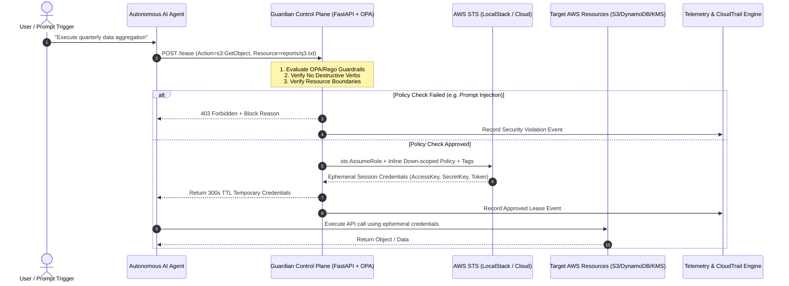

# Strategic Reference Architecture: Zero-Trust Governance for Autonomous Agentic Non-Human Identities (NHI)

**Author / Architect:** Cloud Security Engineering & Architecture  
**Target Environment:** Multi-Account AWS / Cloud-Native Ecosystems  
**Scope:** Autonomous AI Agents, Machine Identities, Ephemeral Token Brokers, Policy-as-Code  

---

## 1. Executive Summary

As cloud organizations transition toward autonomous operations (DevOps agents, pipeline orchestrators, automated data engineers), traditional Identity and Access Management (IAM) paradigms fail. Static IAM roles granted to autonomous agents create catastrophic blast radius risks due to non-deterministic model behavior, prompt injection vulnerabilities, and credential leakage.

This framework introduces the **Agentic IAM Guardian Architecture** — an attested, dynamic, Just-In-Time (JIT) identity broker that enforces cryptographic least-privilege, ephemeral STS down-scoping, and real-time intent verification for all non-human agentic workloads.

---

## 2. Threat Landscape & MITRE ATLAS Alignment

Autonomous agents present unique threat vectors at the intersection of AI safety and cloud infrastructure security.

```
┌─────────────────────────────────────────────────────────────────────────────────┐
│                      MITRE ATLAS THREAT TAXONOMY MAPPING                        │
├────────────────────────────────┬──────────────────────┬─────────────────────────┤
│ Threat Vector                  │ ATLAS Technique ID   │ Guardian Mitigation     │
├────────────────────────────────┼──────────────────────┼─────────────────────────┤
│ LLM Prompt Injection           │ AML.T0054            │ Pre-execution Intent    │
│ (Indirect / Direct Injection)  │                      │ Policy Verification     │
├────────────────────────────────┼──────────────────────┼─────────────────────────┤
│ Excessive Tool Invocation /    │ AML.T0053            │ Down-Scoped Session     │
│ Unauthorized API Action        │                      │ Policy (Zero Wildcards) │
├────────────────────────────────┼──────────────────────┼─────────────────────────┤
│ Non-Human Identity Abuse /     │ AML.T0048            │ Ephemeral TTL Leasing   │
│ Credential Exfiltration        │                      │ (Max 300s Expiration)   │
├────────────────────────────────┼──────────────────────┼─────────────────────────┤
│ Lateral Movement across Cloud  │ AML.T0044            │ Boundary Isolation      │
│ Resources & Cross-Account Hop  │                      │ & Resource Tags         │
└────────────────────────────────┴──────────────────────┴─────────────────────────┘
```

---

## 3. High-Level Architecture Model



---

## 4. Cryptographic Session Policy Specification

When an agent requests permission to execute an action, the Guardian dynamically synthesizes an in-memory AWS IAM Session Policy attached to the `sts:AssumeRole` API call.

### Mathematical Down-Scoping Principle:
Let $P_{Base}$ be the base IAM permissions of the execution role, and $P_{Session}$ be the synthesized inline session policy:

$$\text{Effective Permissions} = P_{Base} \cap P_{Session}$$

Even if $P_{Base}$ holds extensive permissions across the cloud account, the effective permission at execution time is strictly restricted to the intersection, ensuring mathematical least-privilege.

### Synthesized Session Policy Structure:
```json
{
  "Version": "2012-10-17",
  "Statement": [
    {
      "Effect": "Allow",
      "Action": [
        "s3:PutObject"
      ],
      "Resource": [
        "arn:aws:s3:::enterprise-public-reports-bucket/reports/build_log_101.txt"
      ]
    }
  ]
}
```

---

## 5. Non-Human Identity Governance (NHIG) Maturity Model

Organizations adopting autonomous AI agents can evaluate their maturity across 4 progressive tiers:

| Maturity Level | Identity Lifecycle | Policy Enforcement | Audit & Visibility | Risk Profile |
|---|---|---|---|---|
| **Level 0: Legacy** | Static API keys stored in `.env` / agent prompt | Broad IAM roles (e.g., `PowerUserAccess`) | CloudTrail only (reactive) | Critical (Catastrophic blast radius) |
| **Level 1: Static Roles** | Role per agent type | Resource-level IAM policies | Basic logging | High (Overprivileged drift) |
| **Level 2: JIT Ephemeral (Guardian)** | Dynamic STS leasing (300s TTL) | Inline dynamic down-scoping per tool call | Real-time intent ledger + Principal tagging | Low (Deterministic containment) |
| **Level 3: Autonomous Zero-Trust** | Attested runtime enclave (eBPF + Nitro Enclaves) | Multi-modal intent verification with continuous anomaly isolation | Real-time automated SOC isolation & revocation | Minimal (Zero implicit trust) |

---

## 6. Implementation Verification Matrix

The reference implementation in this repository verifies all Level-2 controls:
1. **Zero Wildcards:** All requests with `*` actions or resources are rejected at the control plane.
2. **Anti-Destructive Guardrails:** `s3:Delete*`, `dynamodb:Delete*`, and IAM modifications are blocked deterministically.
3. **Data Boundary Segregation:** Sensitive data stores (`enterprise-confidential-finance-bucket`) reject standard agent personas.
4. **Session Sealing:** Temporary tokens issued for one resource fail if reused against another resource.
